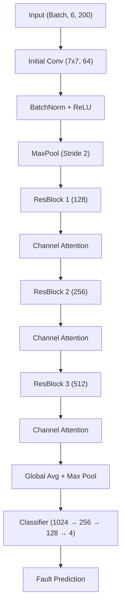
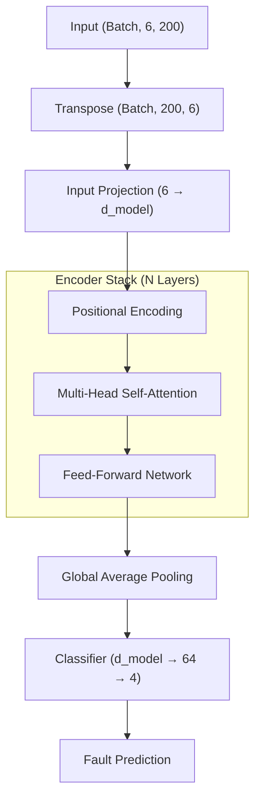

# Model Architectures

This document details the neural network architectures available for motor fault detection.

## 1. Improved CNN (Default)

The **ImprovedMotorFaultCNN** uses residual connections and channel attention to capture complex patterns in the multi-channel time-series data.

### Architecture Diagram

---

## 2. Transformer

The **MotorFaultTransformer** applies self-attention across the time dimension, allowing the model to focus on specific temporal events (spikes, shifts) more effectively than traditional convolutions.

### Architecture Diagram

---

## 3. Comparison Summary

| Feature         | Improved CNN                       | Transformer                      |
| --------------- | ---------------------------------- | -------------------------------- |
| **Core Layer**  | Residual 1D Conv                   | Multi-Head Attention             |
| **Parameters**  | ~2.1 Million                       | ~0.4 Million (Configurable)      |
| **Strength**    | Excellent local feature extraction | Captures long-range dependencies |
| **Suitability** | General motor fault patterns       | Complex, non-periodic transients |

---
