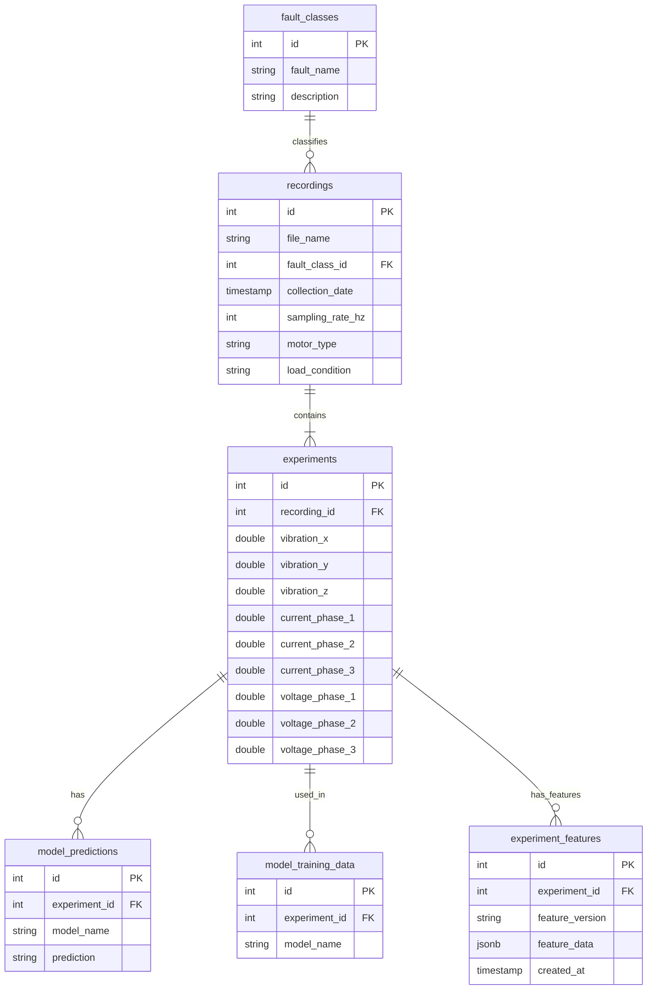

# Database ER Diagram

```mermaid
erDiagram
    fault_classes ||--o{ recordings : "classifies"
    recordings ||--|{ experiments : "contains"
    experiments ||--o{ model_predictions : "has"
    experiments ||--o{ model_training_data : "used_in"
    experiments ||--o{ experiment_features : "has_features"

    fault_classes {
        int id PK
        string fault_name
        string description
    }

    recordings {
        int id PK
        string file_name
        int fault_class_id FK
        timestamp collection_date
        int sampling_rate_hz
        string motor_type
        string load_condition
    }

    experiments {
        int id PK
        int recording_id FK
        double vibration_x
        double vibration_y
        double vibration_z
        double current_phase_1
        double current_phase_2
        double current_phase_3
        double voltage_phase_1
        double voltage_phase_2
        double voltage_phase_3
    }

    model_predictions {
        int id PK
        int experiment_id FK
        string model_name
        string prediction
    }

    model_training_data {
        int id PK
        int experiment_id FK
        string model_name
    }

    experiment_features {
        int id PK
        int experiment_id FK
        string feature_version
        jsonb feature_data
        timestamp created_at
    }
```
