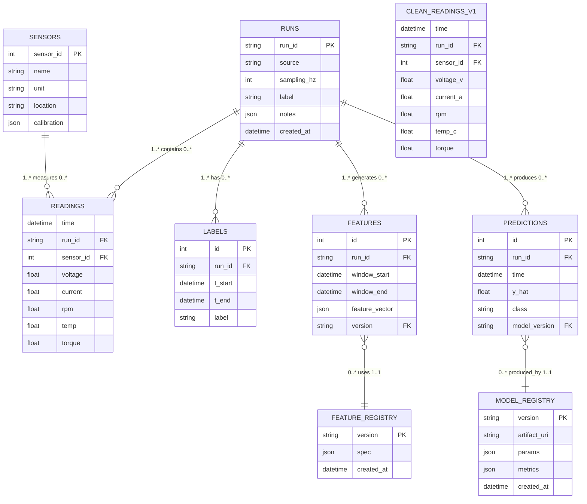

```mermaid
erDiagram
  RUNS || --o{ READINGS : "1..* contains 0..*"
  RUNS ||--o{ LABELS : "1..* has 0..*"
  RUNS ||--o{ FEATURES : "1..* generates 0..*"
  RUNS ||--o{ PREDICTIONS : "1..* produces 0..*"
  SENSORS ||--o{ READINGS : "1..* measures 0..*"
  FEATURES }o--|| FEATURE_REGISTRY : "0..* uses 1..1"
  PREDICTIONS }o--|| MODEL_REGISTRY : "0..* produced_by 1..1"

  RUNS {
    string run_id PK
    string source
    int    sampling_hz
    string label
    json   notes
    datetime created_at
  }

  SENSORS {
    int    sensor_id PK
    string name
    string unit
    string location
    json   calibration
  }

  READINGS {
    datetime time
    string   run_id FK
    int      sensor_id FK
    float    voltage
    float    current
    float    rpm
    float    temp
    float    torque
  }

  CLEAN_READINGS_V1 {
    datetime time
    string   run_id FK
    int      sensor_id FK
    float    voltage_v
    float    current_a
    float    rpm
    float    temp_c
    float    torque
  }

  LABELS {
    int      id PK
    string   run_id FK
    datetime t_start
    datetime t_end
    string   label
  }

  FEATURES {
    int      id PK
    string   run_id FK
    datetime window_start
    datetime window_end
    json     feature_vector
    string   version FK
  }

  FEATURE_REGISTRY {
    string   version PK
    json     spec
    datetime created_at
  }

  PREDICTIONS {
    int      id PK
    string   run_id FK
    datetime time
    float    y_hat
    string   class
    string   model_version FK
  }

  MODEL_REGISTRY {
    string   version PK
    string   artifact_uri
    json     params
    json     metrics
    datetime created_at
  }
```